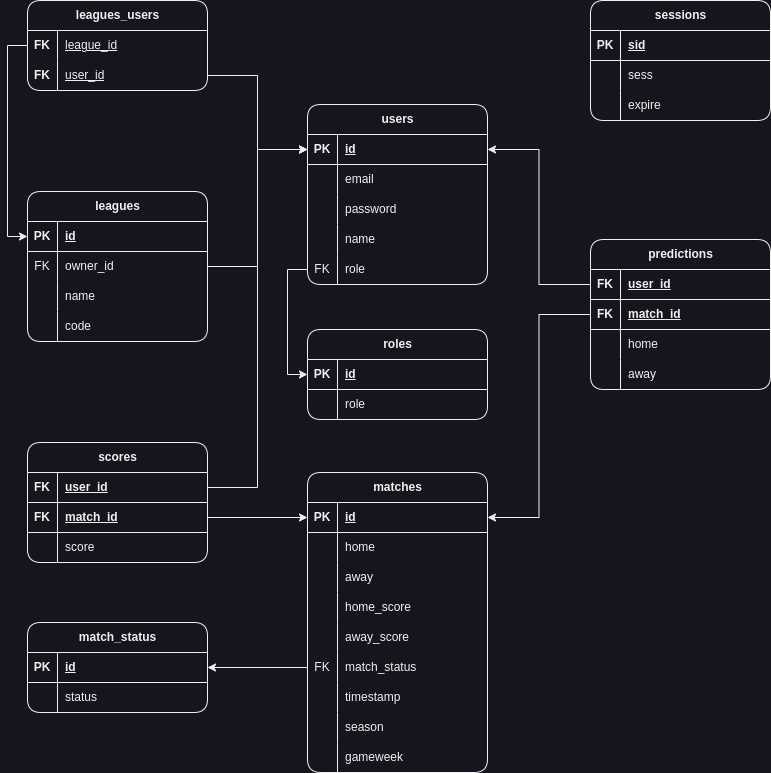

## FotLeague

Football game inspired by Fantasy Premier League, where players predict match scores, earn points and compete in leaderboards!

## Project structure

The project consists of three docker containers, which are organised and run by a docker compose file:
- Backend: ExpressJS 
- Database: Postgres
- Python: Web scraping

## Project initialization

To run this project locally, start by running the docker containers, which will download all the needed dependencies and start all services:

```docker compose up```

Stop the project by running `docker compose down` in another terminal.

Alternatively, you could run this command to be able to Ctrl-C without suspending the containers:

```docker compose up -d && docker compose logs --follow```


## Backend 

The backend is built using `Express`, `Typescript` and the `pg` client

To run the backend tests, open `sh` inside the container and run the test command:

```
docker exec -it fotleague-backend-1 sh
npm run test
```

## Database

The database is initialised on startup using the init.sql commands

Postgres schema:


## Python

The python script scrapes [site] for live match results, and sends the result to the express server. 

This repeats every 5 minutes in an infinite loop. 

## Native Android App

Todo

## Website

Todo
